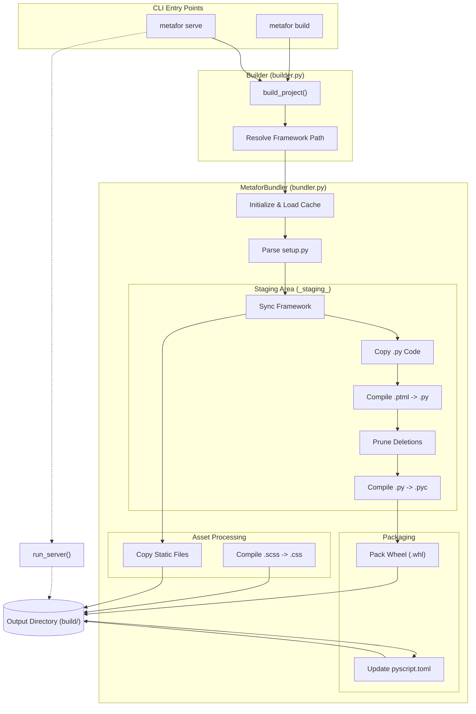

# Metafor Builder Architecture

This document explains the internal workings of the specific `metafor` builder logic used in both `serve` and `production build` commands.

## Overview

The Metafor CLI uses a unified build system for both development (`serve`) and production (`build`). The core logic resides in `metafor_cli.bundler.MetaforBundler`.

### Commands

1.  **`metafor build`**: Use this command to generate a production-ready build of your application.
    -   Entry: `cmd_build` in `main.py`
    -   Action: Invokes `build_project` which runs `MetaforBundler.build()`.
    -   Output: A fully populated `build/` directory containing the static assets, the generated Python wheel, and the configured `pyscript.toml`.

2.  **`metafor serve`**: Use this command for local development.
    -   Entry: `cmd_serve` in `main.py`
    -   Action:
        1.  Runs the exact same build process as `metafor build`.
        2.  Starts a local HTTP server pointing to the `build/` directory.

## Build Process Architecture

The build process is designed to be incremental and efficient, utilizing a caching mechanism to avoid unnecessary work.

### Diagram



## Detailed Workflow steps

### 1. Initialization and Setup
-   **Context**: The builder determines the root directory of the project and attempts to locate the `metafor` framework dependency (local or installed).
-   **Cache**: A `BuildCache` is initialized (`.metafor/cache.json`) to track file hashes and determine what has changed since the last build.
-   **Metadata**: `setup.py` is parsed (using AST) to extract application metadata like name, version, and dependencies.

### 2. Staging Area (`_staging_`)
The bundler maintains a persistent staging directory `build/_staging_`. This directory mirrors the structure of the final Python package.
-   **Framework**: If a local framework path is detected, it is synced to staging.
-   **Application Code**:
    -   `.py` files are copied to staging.
    -   `.ptml` files are compiled into `.py` files and placed in staging.
    -   Deleted source files are pruned from staging to keep it clean.
-   **Optimization**: If `use_pyc` is enabled (default for `build`, disabled for `serve`), `compileall` is run on the staging directory to pre-compile all Python code to bytecode `.pyc` files, improving load performance in the browser.

### 3. Asset Processing
Non-code files are processed and placed directly into the `build/` directory:
-   **Sass/SCSS**: If enabled in `setup.py`, these are compiled to `.css`.
-   **Static Files**: Images, fonts, and other assets are copied as-is.
-   **Special Files**: `index.html`, `pyscript.toml`, and `main.py` are copied to the build root.

### 4. Wheel Packaging
The contents of the `_staging_` directory are packed into a standard Python Wheel (`.whl`) file.
-   **Location**: `build/public/<app_name>-<version>-py3-none-any.whl`
-   **Logic**: The builder checks timestamps to decide if the wheel needs regeneration. If nothing changed in staging, the expensive wheel packing step is skipped.

### 5. Configuration Injection
The final step updates `build/pyscript.toml` to ensure the app runs correctly in the browser.
-   **Packages**: The generated wheel is injected into the `packages` list, along with any dependencies defined in `setup.py`.
-   **Files**: All processed assets (CSS, images, etc.) are injected into the `[files]` section, mapping their VFS paths for the PyScript environment.

## Wheel Generation Internals

The `_pack_wheel` method implements a high-performance, in-memory wheel generator that avoids the overhead of standard build tools (like `setuptools` or `build`).

### 1. Streaming Zip Writes
Instead of creating a temporary directory structure for the wheel contents, the builder streams files directly from the staging area into the target `.whl` (zip) file.
-   **Simultaneous Hashing**: As files are read and written to the zip stream in 64KB chunks, their SHA-256 hash is calculated on the fly. This avoids reading the file twice (once for hashing, once for writing).

### 2. In-Memory Metadata
Standard Python wheel metadata files (`METADATA`, `WHEEL`, `RECORD`) are generated entirely in memory and injected into the zip archive.
-   **No Disk I/O**: These files never exist on the host filesystem, reducing I/O operations.
-   **Dynamic RECORD**: The `RECORD` file, which lists all files and their hashes, is constructed in memory as the files are processed and appended to the zip archive at the very end.

```python
# Conceptual flow of _pack_wheel
with ZipFile(wheel_path) as zf:
    for file in staging:
        # Stream content to zip + update hash
        sha = hash_chunks(file, zf) 
        records.append(f"{file},{sha}")

    # Write metadata strings directly to zip
    zf.writestr(".../METADATA", generate_metadata())
    zf.writestr(".../WHEEL", wheel_info())
    zf.writestr(".../RECORD", "\n".join(records))
```
