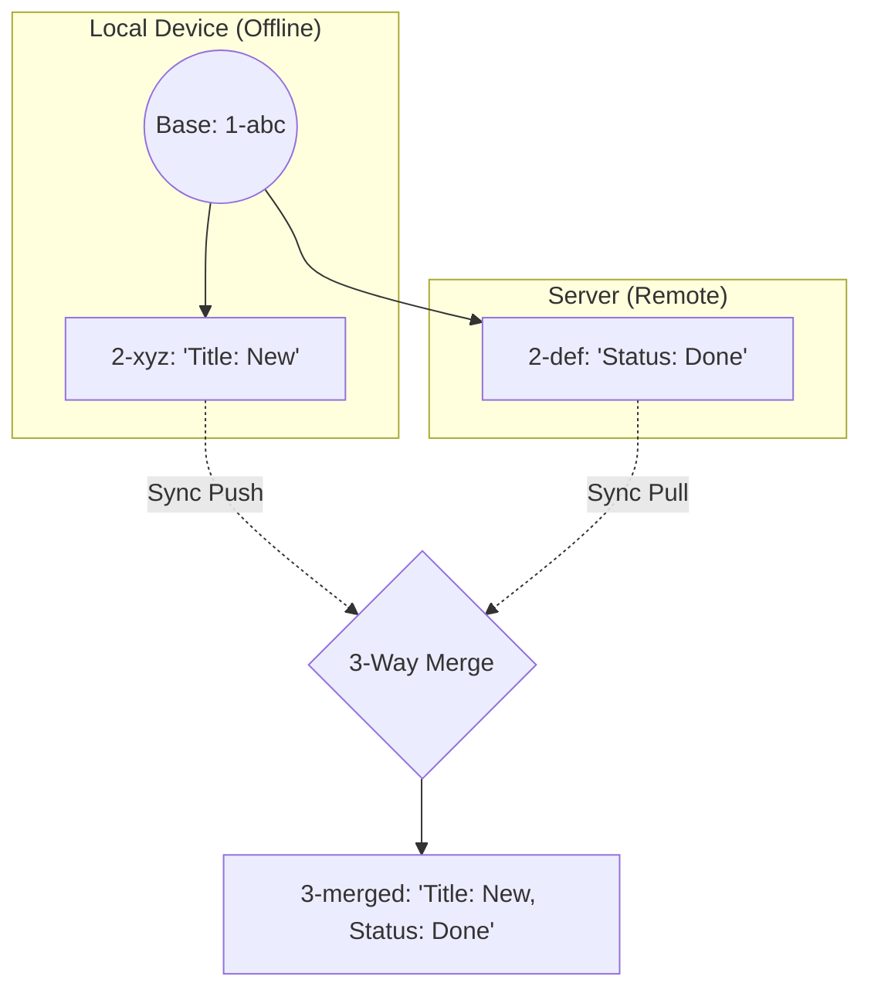
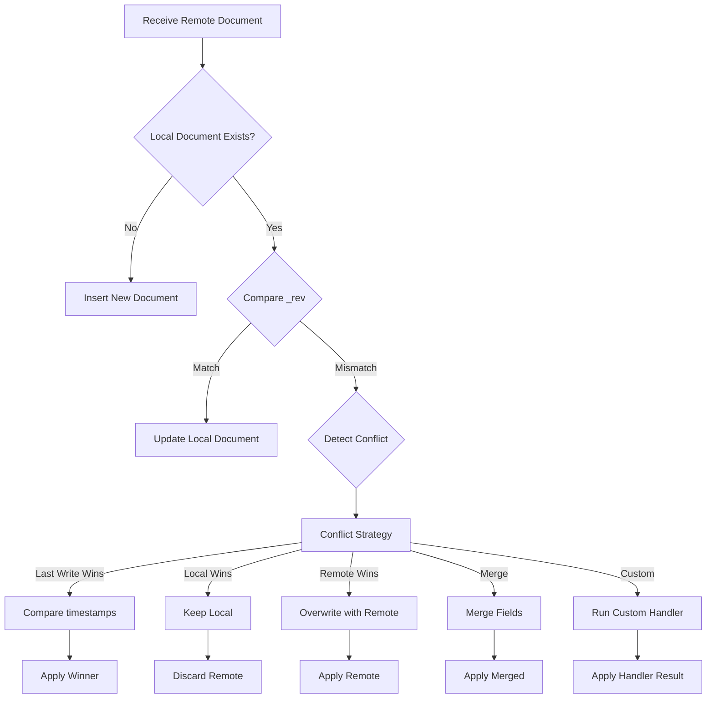

# Offline Sync Engine

The Metafor Sync Engine provides robust, offline-first data synchronization capabilities for `Indexie`, inspired by RxDB. It allows your application to function seamlessly without network connectivity, queuing changes locally and synchronizing them with a backend when connectivity is restored.

## Architecture

The Sync Engine sits between your application logic and the IndexedDB storage. It uses **Hooks** to intercept writes and an **Offline Queue** to store mutations.

```
┌───────────────────────────────────────────────────────────────┐
│                       APPLICATION LOGIC                       │
│  (Writes via db.table.add / db.table.put / db.table.delete)   │
└───────────────┬───────────────────────────────┬───────────────┘
                │                               │
                ▼                               ▼
    ┌───────────────────────┐       ┌───────────────────────┐
    │    Online (Default)   │       │   Offline / Direct    │
    │    (OverlayLayer)     │       │  (DirectTransaction)  │
    └──────┬─────────┬──────┘       └───────────┬───────────┘
           │         │                          │
           │         │ (Manual API Call)        │ (Direct Writes)
           │         ▼                          ▼
           │  ┌─────────────┐       ┌───────────────────────┐
           │  │ BACKEND API │       │      INDEXIE CORE     │
           │  └─────────────┘       └───────────┬───────────┘
           │                                    │
           │ (Optimistic Updates)               ▼
           ▼                        ┌───────────────────────┐
    ┌───────────────────────┐       │    HOOK SYSTEM        │
    │   In-Memory Overlay   │       │ (on_add, on_update)   │
    │   (UI Updates Fast)   │       └───────────┬───────────┘
    └───────────────────────┘                   │
                                                ▼
                                    ┌───────────────────────┐
                                    │     OFFLINE QUEUE     │
                                    │   (_sys_sync_queue)   │
                                    └───────────┬───────────┘
                                                │
                                                ▼
                                    ┌───────────────────────┐
                                    │     SYNC MANAGER      │
                                    │      (Background)     │
                                    │                       │
                                    │  ┌─────────────────┐  │
                                    │  │    PUSH LOOP    │  │
                                    │  │ (POST /push)    │──┼──► UPSTREAM
                                    │  └────────┬────────┘  │
                                    │           │           │
                                    │  ┌────────▼────────┐  │
                                    │  │    PULL LOOP    │◄─┼─── (Optional)
                                    │  │  (GET /pull)    │  │
                                    │  └─────────────────┘  │
                                    └───────────────────────┘
```

## features

### 1. Offline Queue
Any `add`, `put`, or `delete` operation performed on a table is transparently captured and stored in the `_sys_sync_queue` table. This happens regardless of network status (unless using Optimistic Transactions, see below).

### 2. Push/Pull Replication
-   **Push**: The `SyncManager` watches the queue and automatically sends batches of mutations to the configured upstream URL via `POST /push` when the devise is online.
-   **Pull**: By default, it periodically polls `GET /pull` to fetch downstream changes and applies them to the local database.

### 3. Revision Trees (Conflict-Free Tree System)
The sync engine implements a **Revision Tree Architecture** (similar to CouchDB/RxDB) to ensure data consistency without locking.
-   **Structure**: Data is stored as a tree of revisions. Each update creates a new child node (e.g., `1-abc` -> `2-xyz`).
-   **Generation-Based**: Revisions use an `N-hash` format (`Generation-Hash`) to track ancestry depth explicitly.
-   **Automatic Rotation**: Every local update automatically increments the revision generation, creating a traceable history.
-   **Conflict Handling**: Divergent branches (e.g., Local `2-xyz` vs Remote `2-def`) differ in hash but share ancestry, allowing automated 3-way merging.

### Revision Tree Visualization



## Configuration

To enable sync, configure it before opening the database.

```python
db = Indexie("MyApp")

# Standard Configuration (last-write-wins conflict resolution)
db.enable_sync("https://api.example.com/sync")

await db.open()
```

### Sync Flow Logic

When a new document payload is received from the server (Pull), the Sync Engine performs the following checks to maintain the Revision Tree:



#### Resolution Strategies

1.  **Last Write Wins (Default)**: Compares `_lastModified` timestamps. The document with the later timestamp wins.
    ```python
    db.enable_sync(url, conflict_strategy=SyncManager.ConflictStrategy.LAST_WRITE_WINS)
    ```

2.  **Local Wins**: Always ignores the remote update if a conflict exists.
    ```python
    db.enable_sync(url, conflict_strategy=SyncManager.ConflictStrategy.LOCAL_WINS)
    ```

3.  **Remote Wins**: Always overwrites the local version with the remote version.
    ```python
    db.enable_sync(url, conflict_strategy=SyncManager.ConflictStrategy.REMOTE_WINS)
    ```

4.  **Merge (3-Way)**: Uses the **Revision Tree** to find the common ancestor (**Base Document**, retrieved from the Offline Queue). It intelligently combines non-conflicting changes from both Local and Remote branches.
    ```python
    db.enable_sync(url, conflict_strategy=SyncManager.ConflictStrategy.MERGE)
    ```

5.  **Custom Handler**: Define your own logic.
    ```python
    async def resolve_conflict(conflict):
        # conflict.local_doc, conflict.remote_doc, conflict.table_name...
        if conflict.local_doc["version"] > conflict.remote_doc["version"]:
            return conflict.local_doc
        return conflict.remote_doc

    db.enable_sync(
        url, 
        conflict_strategy=SyncManager.ConflictStrategy.CUSTOM,
        conflict_handler=resolve_conflict
    )
    ```

### Inspecting Conflicts

All conflicts are automatically recorded in the `_sys_conflict_history` table:

```python
# Get all conflicts
conflicts = await db.sync_manager.conflict_history.get_all()

# Clear conflict history
await db.sync_manager.conflict_history.clear()
```

### Integration with ElectricSQL / Replicache
If you are using a specialized sync solution like **ElectricSQL** for downstream updates (server-to-client), you should **disable** the built-in pull mechanism to avoid conflicts and redundant data fetching.

```python
# Disable Pull, keep Offline Queue + Push
db.enable_sync("https://api.example.com/sync", pull_enabled=False)
```

In this mode:
-   **Writes** are queued and pushed by `SyncManager`.
-   **Reads** are updated via your external stream (e.g., ElectricSQL SSE).

## Optimistic Transactions & Offline Support

The `start_transaction(optimistic=True)` context manager is network-aware, providing the best user experience based on connectivity.

### Current Optimizations
*   **Batching**: Mutations are pushed in batches (default: 50) to minimize HTTP overhead.
*   **Delta Pulls**: Uses a `checkpoint` cursor to fetch only new data from the server.
*   **Background Processing**: Sync runs in a non-blocking background loop.
*   **Latency (Immediate Trigger)**: Writes automatically trigger an immediate (debounced) push attempt, ensuring near-instant synchronization without waiting for the periodic interval.

### Missing Optimizations (Potential Improvements)
*   **Bandwidth (Diff Sync)**: The engine currently sends the full document on every update. It does not calculate or send field-level diffs, which would save bandwidth for large documents with small changes.
*   **Parallelism**: The `_process_loop` runs Push and Pull operations sequentially. Running them in parallel tasks could improve throughput in some scenarios.

### Online Behavior
-   **Mode**: Optimistic UI.
-   **Mechanism**: Writes are applied to an in-memory **Overlay**. The UI updates immediately.
-   **Sync**: When the transaction commits, writes are persisted to IndexedDB and **automatically queued** for background sync.
-   **Outcome**: Instant UI feedback + Robust data synchronization. No manual API calls needed.

### Usage Example

```python
async with db.todos.start_transaction(optimistic=True):
    # UI updates instantly!
    # Data is saved to DB and synced in background automatically.
    await db.todos.add(new_todo)
```

## Server-Side Requirements

To fully support the **Revision Tree** and **Conflict Resolution**, your backend database **MUST** store and handle specific metadata fields. You cannot simply discard them.

### Required Columns
Your server tables (e.g., Postgres/MySQL) need these columns:

| Column | Type | Purpose |
| :--- | :--- | :--- |
| `_rev` | `VARCHAR` | Stores the current revision ID (e.g., `1-abc...`). Used to detect if an incoming PUSH is based on the current version or an old one. |
| `_lastModified` | `BIGINT` | Unix timestamp (ms) of the last update. The "Tie-Breaker" for Last-Write-Wins. |
| `_deleted` | `BOOLEAN` | (Optional but recommended) Stores "Soft Deletes" (Tombstones) so they can be synced to clients. |

### Server Logic (Push Handler)
When receiving a **PUSH** from a client:
1.  **Check Revision**: Compare incoming `_rev` with stored `_rev`.
    *   If they match (or incoming is child of stored), **ACCEPT**.
    *   If they diverge, **CHECK TIMESTAMPS**.
2.  **Last-Write-Wins**:
    *   If `Incoming._lastModified > Stored._lastModified`: **OVERWRITE**.
    *   If `Incoming._lastModified < Stored._lastModified`: **REJECT** (Server Wins).

### Server Logic (Pull Handler)
When sending a **PULL** response:
1.  Include `_rev` and `_lastModified` in every document object.
2.  For deletions, send a **Tombstone** object containing `_rev`, `_lastModified`, and `_deleted: true`.

**Warning**: If your server does not store these fields, clients will constantly treat server data as "New/Conflicting" or "Old", leading to infinite sync loops or data loss.
