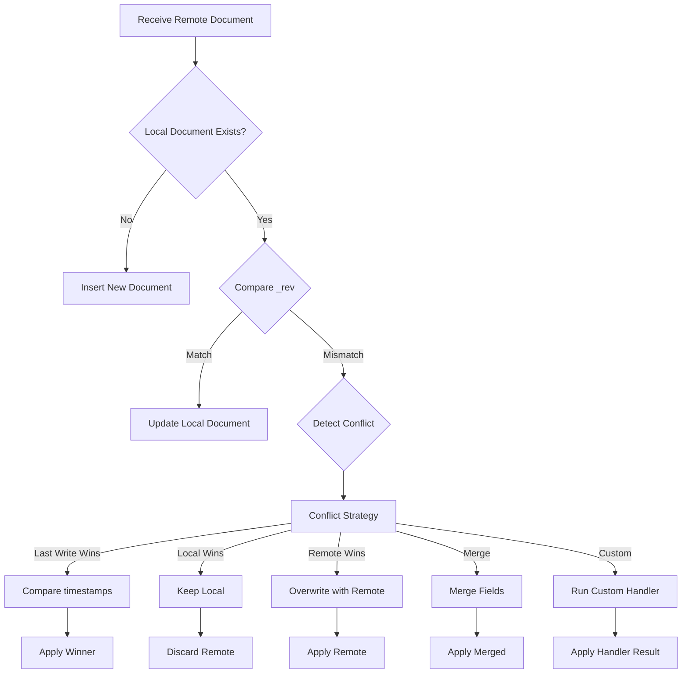

# Offline Sync Engine

The Metafor Sync Engine provides robust, offline-first data synchronization capabilities for `Indexie`, inspired by RxDB. It allows your application to function seamlessly without network connectivity, queuing changes locally and synchronizing them with a backend when connectivity is restored.

## Architecture

The Sync Engine sits between your application logic and the IndexedDB storage. It uses **Hooks** to intercept writes and an **Offline Queue** to store mutations.

```
┌───────────────────────────────────────────────────────────────┐
│                       APPLICATION LOGIC                       │
│  (Writes via db.table.add / db.table.put / db.table.delete)   │
└───────────────┬───────────────────────────────┬───────────────┘
                │                               │
                ▼                               ▼
    ┌───────────────────────┐       ┌───────────────────────┐
    │    Online (Default)   │       │   Offline / Direct    │
    │    (OverlayLayer)     │       │  (DirectTransaction)  │
    └──────┬─────────┬──────┘       └───────────┬───────────┘
           │         │                          │
           │         │ (Manual API Call)        │ (Direct Writes)
           │         ▼                          ▼
           │  ┌─────────────┐       ┌───────────────────────┐
           │  │ BACKEND API │       │      INDEXIE CORE     │
           │  └─────────────┘       └───────────┬───────────┘
           │                                    │
           │ (Optimistic Updates)               ▼
           ▼                        ┌───────────────────────┐
    ┌───────────────────────┐       │    HOOK SYSTEM        │
    │   In-Memory Overlay   │       │ (on_add, on_update)   │
    │   (UI Updates Fast)   │       └───────────┬───────────┘
    └───────────────────────┘                   │
                                                ▼
                                    ┌───────────────────────┐
                                    │     OFFLINE QUEUE     │
                                    │   (_sys_sync_queue)   │
                                    └───────────┬───────────┘
                                                │
                                                ▼
                                    ┌───────────────────────┐
                                    │     SYNC MANAGER      │
                                    │      (Background)     │
                                    │                       │
                                    │  ┌─────────────────┐  │
                                    │  │    PUSH LOOP    │  │
                                    │  │ (POST /push)    │──┼──► UPSTREAM
                                    │  └────────┬────────┘  │
                                    │           │           │
                                    │  ┌────────▼────────┐  │
                                    │  │    PULL LOOP    │◄─┼─── (Optional)
                                    │  │  (GET /pull)    │  │
                                    │  └─────────────────┘  │
                                    └───────────────────────┘
```

## features

### 1. Offline Queue
Any `add`, `put`, or `delete` operation performed on a table is transparently captured and stored in the `_sys_sync_queue` table. This happens regardless of network status (unless using Optimistic Transactions, see below).

### 2. Push/Pull Replication
-   **Push**: The `SyncManager` watches the queue and automatically sends batches of mutations to the configured upstream URL via `POST /push` when the devise is online.
-   **Pull**: By default, it periodically polls `GET /pull` to fetch downstream changes and applies them to the local database.

### 3. Conflict Resolution
The sync engine includes built-in conflict detection and resolution strategies:
-   **Revision Tracking**: Documents automatically get `_rev` (revision) and `_lastModified` fields
-   **Conflict Detection**: Conflicts are detected when local and remote documents have different revisions
-   **Resolution Strategies**: Multiple strategies available (last-write-wins, local-wins, remote-wins, merge, custom)
-   **Conflict History**: All conflicts are recorded in `_sys_conflict_history` for inspection

## Configuration

To enable sync, configure it before opening the database.

```python
db = Indexie("MyApp")

# Standard Configuration (last-write-wins conflict resolution)
db.enable_sync("https://api.example.com/sync")

await db.open()
```

### Conflict Resolution

When a new document payload is received from the server (Pull), the Sync Engine performs the following checks:



#### Resolution Strategies

1.  **Last Write Wins (Default)**: Compares `_lastModified` timestamps. The document with the later timestamp wins.
    ```python
    db.enable_sync(url, conflict_strategy=SyncManager.ConflictStrategy.LAST_WRITE_WINS)
    ```

2.  **Local Wins**: Always ignores the remote update if a conflict exists.
    ```python
    db.enable_sync(url, conflict_strategy=SyncManager.ConflictStrategy.LOCAL_WINS)
    ```

3.  **Remote Wins**: Always overwrites the local version with the remote version.
    ```python
    db.enable_sync(url, conflict_strategy=SyncManager.ConflictStrategy.REMOTE_WINS)
    ```

4.  **Merge**: Combines fields from both documents. Remote fields take precedence for overlapping keys.
    ```python
    db.enable_sync(url, conflict_strategy=SyncManager.ConflictStrategy.MERGE)
    ```

5.  **Custom Handler**: Define your own logic.
    ```python
    async def resolve_conflict(conflict):
        # conflict.local_doc, conflict.remote_doc, conflict.table_name...
        if conflict.local_doc["version"] > conflict.remote_doc["version"]:
            return conflict.local_doc
        return conflict.remote_doc

    db.enable_sync(
        url, 
        conflict_strategy=SyncManager.ConflictStrategy.CUSTOM,
        conflict_handler=resolve_conflict
    )
    ```

### Inspecting Conflicts

All conflicts are automatically recorded in the `_sys_conflict_history` table:

```python
# Get all conflicts
conflicts = await db.sync_manager.conflict_history.get_all()

# Clear conflict history
await db.sync_manager.conflict_history.clear()
```

### Integration with ElectricSQL / Replicache
If you are using a specialized sync solution like **ElectricSQL** for downstream updates (server-to-client), you should **disable** the built-in pull mechanism to avoid conflicts and redundant data fetching.

```python
# Disable Pull, keep Offline Queue + Push
db.enable_sync("https://api.example.com/sync", pull_enabled=False)
```

In this mode:
-   **Writes** are queued and pushed by `SyncManager`.
-   **Reads** are updated via your external stream (e.g., ElectricSQL SSE).

## Optimistic Transactions & Offline Support

The `start_transaction(optimistic=True)` context manager is network-aware, providing the best user experience based on connectivity.

### Online Behavior
-   **Mode**: Optimistic UI.
-   **Mechanism**: Writes are applied to an in-memory **Overlay**. The UI updates immediately.
-   **Sync**: These writes are **NOT** queued for sync. It is assumed that your code will make an API call to the backend immediately after the optimistic update.
-   **Outcome**: Instant feedback, no double-writes to queue.

### Offline Behavior
-   **Mode**: Direct Write / Queue.
-   **Mechanism**: Writes bypass the overlay and go **DIRECTLY** to IndexedDB.
-   **Sync**: These writes **TRIGGER** hooks and are added to the **Offline Queue**.
-   **Outcome**: Data is safely stored locally and will be synced automatically when the device goes back online.

### Usage Example

```python
async with db.todos.start_transaction(optimistic=True):
    # This single block handles both scenarios!
    await db.todos.add(new_todo)
    
    # If we are online, we should also tell the server
    if db.sync_manager.is_online:
         await api_client.create_todo(new_todo)
```
